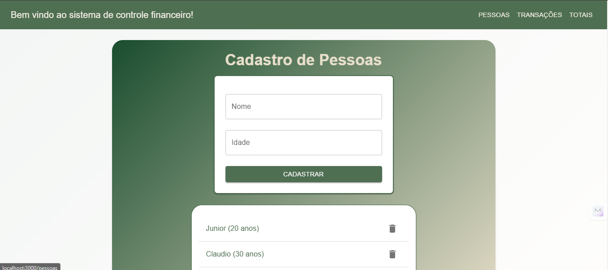

# Frontend do Sistema de Controle de Gastos

Este é o frontend do **Sistema de Controle de Gastos**, desenvolvido em React com Material-UI. Ele permite cadastrar pessoas, transações e consultar totais de receitas, despesas e saldos.

## 🚀 Como Executar

### Pré-requisitos
- Node.js (versão 16 ou superior)!

- NPM ou Yarn

🛠 Tecnologias Utilizadas
React: Biblioteca para construção da interface.

Material-UI: Biblioteca de componentes estilizados.

Axios: Cliente HTTP para consumir a API.

React Router DOM: Gerenciamento de rotas no frontend.

## 🖼 Screenshot

